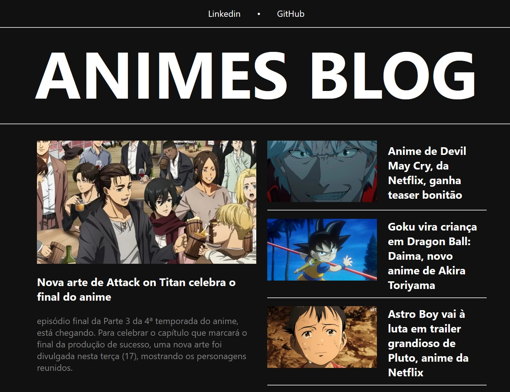

# PROJETO - BLOG FEITO COM ANGULAR

## Sobre
Este é um projeto de um blog sobre animes desenvolvido em Angular.
O blog foi criado como um desafio pessoal, através da DIO.me, para aprender e praticar Angular, um dos principais frameworks para desenvolvimento web.

## Tecnologia

O blog foi desenvolvido usando Angular, uma plataforma para construir aplicações web com HTML, CSS e TypeScript.

## Instalação

Para instalar e executar o blog localmente, você precisa ter o Node.js e o Angular CLI instalados no seu computador. Depois, siga estes passos:

- Clone ou baixe este repositório para a sua máquina.
- Abra um terminal na pasta do projeto e execute npm install para instalar as dependências.
- Execute ng serve para iniciar um servidor de desenvolvimento na porta 4200.
- Acesse http://localhost:4200 no seu navegador para ver o blog.
Você também pode ver o blog online neste link: [Blog de animes com Angular]()

## Uso

O blog possui as seguintes funcionalidades:
- Página Home, com links de contatos (Linkedin e Github), título do site e conteúdos da página tendo um conteúdo em destaque e outros populares.

## Contato

[Linkedin](https://www.linkedin.com/in/thiago-aquino-75b07023a)
[Gmail](thiagoaquino.df@gmail.com)
